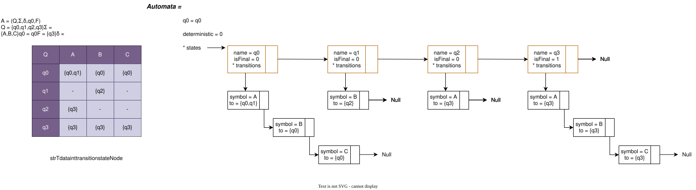

# Simulador y Procesador de Autómatas Finitos (TAD en C)

Este proyecto implementa un modelo abstracto para la representación, manipulación y simulación de **Autómatas Finitos Deterministas (AFD)** y **No Deterministas (AFND)** en lenguaje C.

El desarrollo se enfoca en el uso riguroso de **Tipos Abstractos de Datos (TADs)** para garantizar la separación de responsabilidades entre el modelo formal del autómata y las estructuras de datos auxiliares (listas, conjuntos y cadenas).

## 🚀 Características Principales

* **Carga Dinámica de Autómatas:** Carga de configuraciones desde archivos de texto (`.txt`) o cadenas formateadas.
* **Procesamiento de Cadenas:** Simulación del recorrido de estados y validación de aceptación de cadenas para AFD y AFND.
* **Conversión AFND a AFD:** Algoritmo de construcción por subconjuntos para transformar un autómata no determinista en un autómata determinista equivalente con renombramiento automático de estados.
* **Recuperación de Tupla Formal:** Extracción abstracta de las componentes del autómata $A = (Q, \Sigma, \delta, q_0, F)$.
* **Visualización:** Formateo en pantalla tanto de la tabla de transiciones como de la tupla formal matemática.

## 📐 Arquitectura de TADs y Encapsulamiento

El proyecto está estructurado modularmente para aislar el comportamiento de los datos respecto a su representación en memoria:

* `String.h / String.c`: Módulo auxiliar para la abstracción y manipulación segura de cadenas de caracteres (`str`).
* `TAD_Data.h / TAD_Data.c`: Implementación de la estructura unificada `Tdata` que actúa como contenedor dinámico para elementos atómicos (`STR`), colecciones ordenadas (`LIST`) y conjuntos de elementos únicos (`SET`). Expone una interfaz pública mediante primitivas de iteración y acceso seguro (`data_first`, `data_next`, `data_element`, `get_str_value`).
* `TAD_AF.h / TAD_AF.c`: Define los tipos de datos abstractos para representar Estados (`StateNode`), Transiciones (`Transition`) y el Autómata (`Automata`). Consume exclusivamente las funciones públicas de `TAD_Data` respetando el principio de ocultamiento de información.

## 🛠️ Compilación y Ejecución

Puedes compilar el proyecto utilizando `gcc` desde la terminal:

```bash
gcc -o simulador main.c TAD_AF.c TAD_Data.c String.c
```

## 🛠️ Estructura Interna en Memoria (Ejemplo)

El autómata se representa mediante una estructura multilista dinámica, compuesta por una lista principal de estados (`stateNode`) y sublistas enlazadas para sus transiciones (`transition`).

